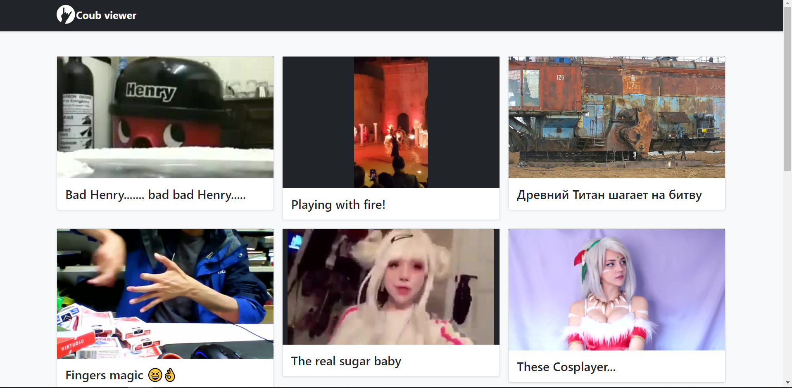
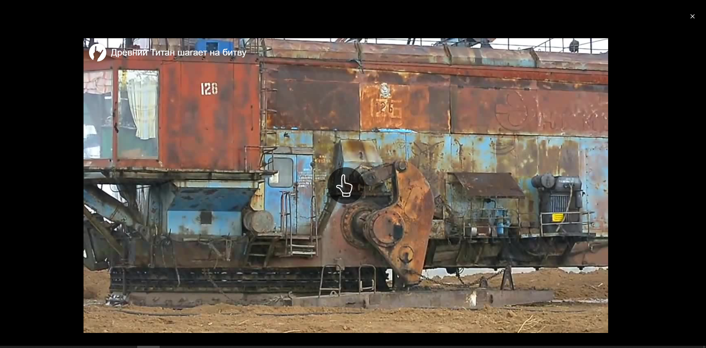

# Coub downloader & Viewer

Необходимый софт
* [python3.7+](https://www.python.org/downloads/)
* [pip](https://pythonru.com/baza-znanij/ustanovka-pip-dlja-python-i-bazovye-komandy)
* браузер

Рекомендуется во время установки поставить ✅ Add Python 3.x to PATH

#### 1. Установка зависимостей

Linux `python3 -m pip install -r requirements.txt`

Windows `python -m pip install -r requirements.txt`

#### 2. Вытягивание json объектов которые хранят информацию о коубах которые вы лайкнули

1. Откройте в браузере coub.com, войдите в учетную запись
2. Откройте инструменты разработчика (обычно открывается при нажатии F12)
3. Перейдите во вкладку console
4. Вставьте код из файла to_browser.js в консоль и дождитесь окончания его работы. Во время
работы скрипта сайт может работать некорректно. Не переходите по ссылкам во вкладке в 
которой работает данный скрипт
5. После окончания работы автоматически скачается файл со всеми метаданными кубов которые вы лайкнули.

Если файл не скачался то из консоли то скопируйте объект который находится под надписью 
`script done! please copy object below and save it to file.json! Right click on object -> Copy object`
откройте блокнот, вставьте текст из буфера обмена и сохраните в файл с названием likes.json

#### 3. Редактирование конфигурации

Откройте файл config.py и отредактируйте необходимые параметры.

#### 4. Запуск процесса скачивания кубов

1. Запустите в консоли `python3 coub_backuper.py <путь до json файла>`.
2. Дождитесь загрузки ваших коубов.

#### 5. Запустите локальный инстанс плеера для кубов

1. Запустите в консоли `python3 viewer.py <путь до json файла>`.
2. Откройте в браузере [http://localhost:8888/](http://localhost:8888/)
3. Наслаждайтесь 😊
